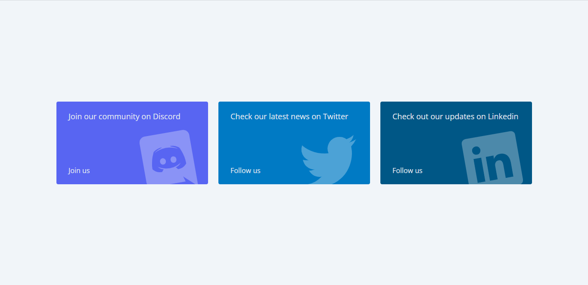
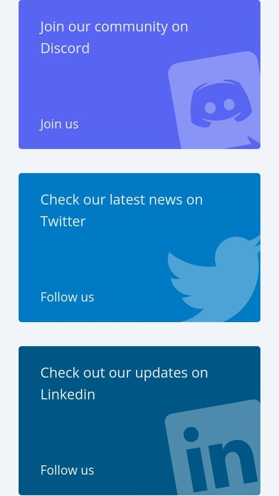

# Social Cards - ‹div›RIOTS

## 📄 Summary

<br>

<div align="center">
  
</div>

<br>

**Single-Page Application (SPA)** for practical purposes, is made in much the same way the three social cards of the site of [`‹div›RIOTS`](https://divriots.com/) includes **Discord, Twitter and LinkedIn.**

## 📝 It is used

- [SWC (Plugin)](https://swc.rs/) for Fast Refresh.
- Vite (v4.4.5)
- TypeScript (v5.0.2)
- React (v18.2.0)
- Tailwindcss (v3.3.3)

## 🎯 Setup

### 📦 Installation

```shell
pnpm i
```

### 🚀 Run

```shell
pnpm dev
```

### 🔨 Build

```shell
pnpm build
```

## Screenshots

<div align="center">
  
</div>

<br>

<div align="center">
  
</div>

## 🔑 License

MIT Lisence
